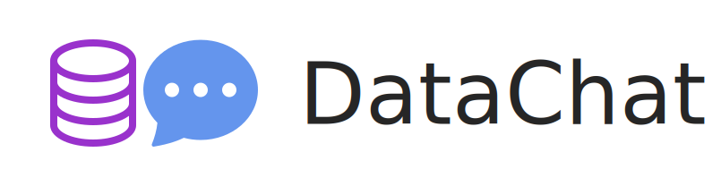
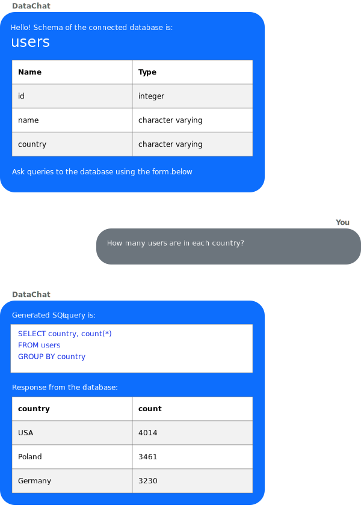

[](#)
&nbsp;
[](#)
&nbsp;
[](#)
&nbsp;
[](#)
&nbsp;
[](LICENSE)

# DataChat

Quick data exploration as a chat!



## Summary

DataChat connects to any PostgreSQL database.

It allows you to explore your data in a form of chat.

DataChat is a web application built with Rust + Tokio axum and React + Redux.

## How to run

**Easy setup in 5 minutes** ⏰ – with Docker Compose!

First, build the images:

```shell
./builddocker.sh
```

Then start the docker-compose:

```shell
docker-compose up
```

Initialize database with sample data:
```shell
./initdb.sh
```

Now you can access the application in your browser at http://localhost ✨

🚧 **Work in progress:** Support for queries in natural language will be delivered soon!

## Quote

This software was inspired by an insight into why Pixar began to be successful – moving from specialized video editing software to feature films in theaters.

> With the rest of Pixar’s technology, you had to be an expert to understand it. [… But] you didn’t have to know anything about the technology to enjoy the film. […] We wanted to use our technology to make something where nobody needed to know anything about the technology to love it.
>
> &nbsp;&nbsp;&nbsp;&nbsp;– Steve Jobs, [Make Something Wonderful](https://stevejobsarchive.com/book)
